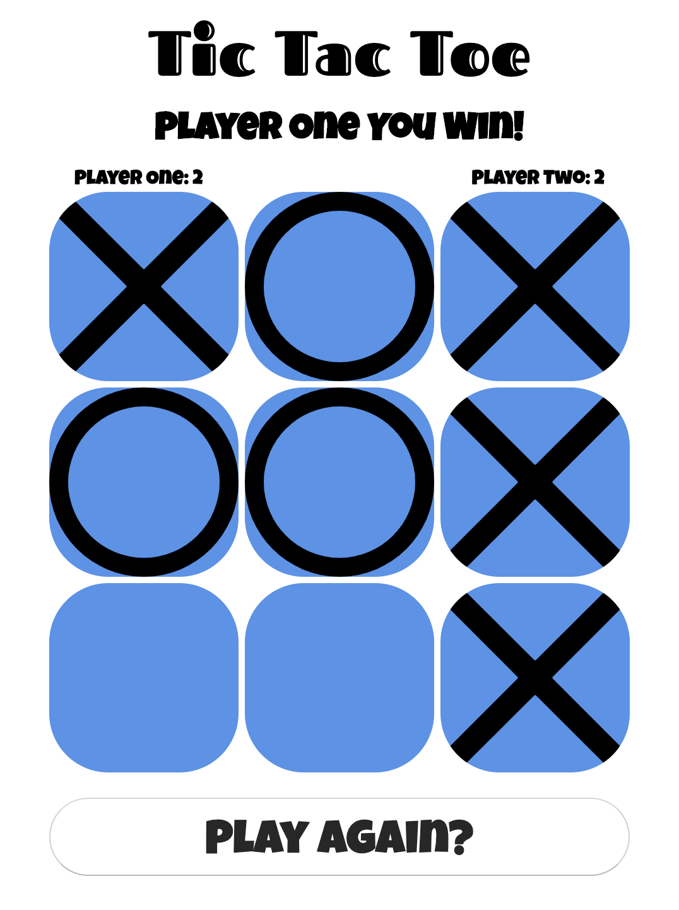

# Tic Tac Toe
## The Classic Childhood Game

**Functionality**
1. The code detects a win state through if statements.
2. Has a board clear function that initialises the backends logic when the "Play Again" button is clicked.
3. It also stores the win count in a variable which is incremented when the win condition is met.
4. Dom manipulation is done with jQuery!

**Live Site**
https://firemugen.github.io/project0/

**Screenshot**

**Languages**
1. JavaScript
2. HTML
3. CSS

No known bugs at this point. 

### A Game By Max Reeves
